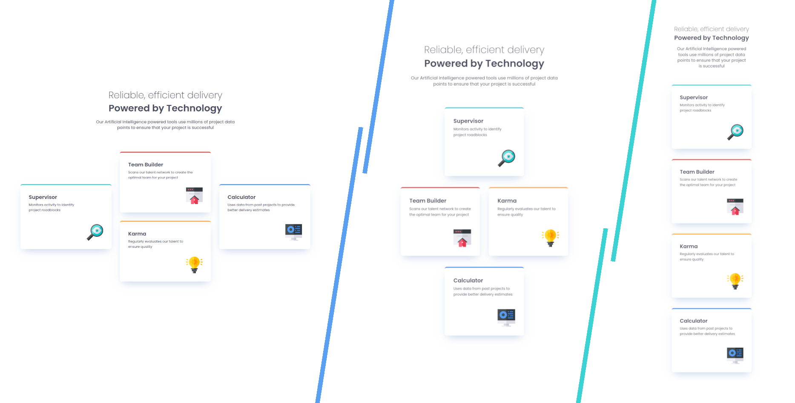

# Frontend Mentor - Four card feature section solution

This is a solution to the [Four card feature section challenge on Frontend Mentor](https://www.frontendmentor.io/challenges/four-card-feature-section-weK1eFYK). Frontend Mentor challenges help you improve your coding skills by building realistic projects. 

## Table of contents 

- [Overview](#overview)
    - [Screenshot](#screenshot)
    - [Links](#links)
- [My process](#my-process)
    - [Built with](#built-with)
- [Author](#author)

## Overview

### Screenshot

### Links

Live Site URL: [GitHub Pages]()

## My process

### Built with

- Semantic HTML 5 markup
- CSS logic properties
- Mobile-first workflow
- Flexbox and Grid
- RWD
- Sass
- CUBE CSS
- Accessibility

## Author

- LinkedIn [KonradJam](www.linkedin.com/in/konradjam)
- X [KonradJam_](https://x.com/KonradJam_)
- Frontend Mentor [KonradJam](https://www.frontendmentor.io/profile/KonradJam)
- Codewars [KonradJam](https://www.codewars.com/users/KonradJam)
- CodePen [KonradJam](https://codepen.io/konradjam)
